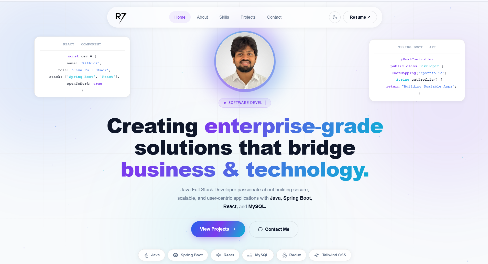
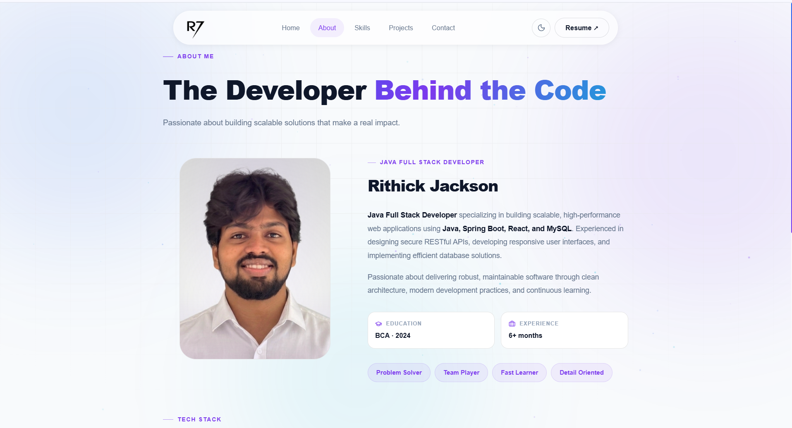
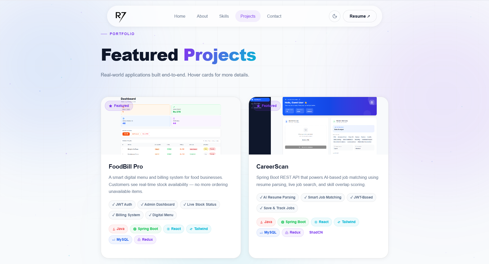
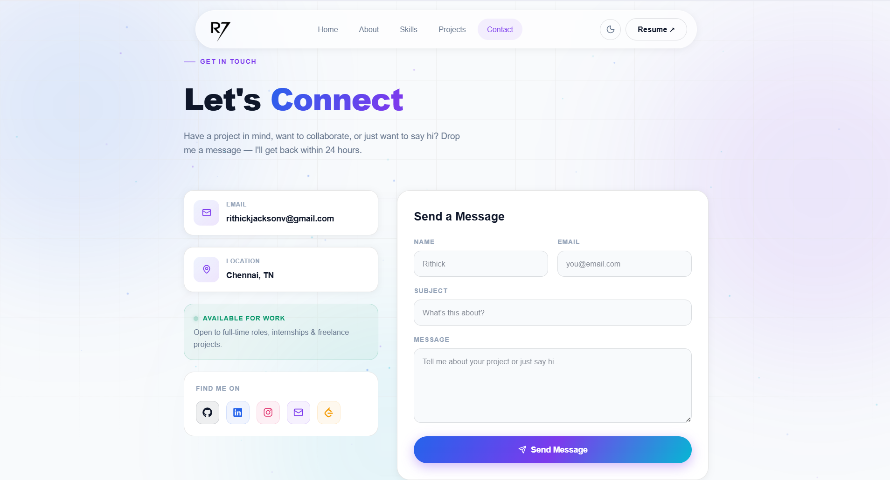
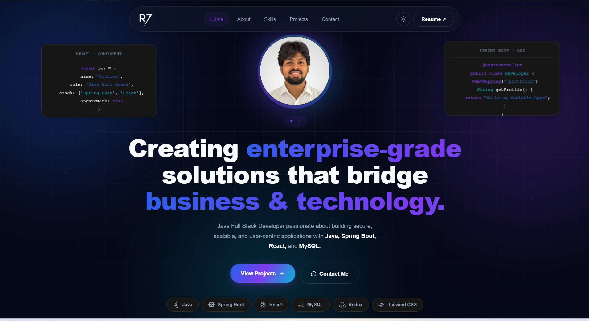

# 🚀 Rithick Jackson — Developer Portfolio

<div align="center">



[](https://reactjs.org/)
[](https://vitejs.dev/)
[](https://tailwindcss.com/)
[](https://www.framer.com/motion/)

**A premium, fully responsive developer portfolio built with React, Vite, Tailwind CSS v4, and Framer Motion.**

[🌐 Live Demo](https://your-portfolio-link.com) · [📧 Contact](mailto:rithickjacksonv@gmail.com) · [💼 LinkedIn](https://www.linkedin.com/in/rithickjackson/)

</div>

---

## ✨ Features

- 🎨 **Premium UI Design** — Glassmorphism navbar, gradient text, soft glowing blobs
- 🌙 **Dark / Light Mode** — Smooth animated theme switching with persistent preference
- ⚡ **Smooth Scrolling** — Powered by Lenis for buttery smooth scroll experience
- 🎭 **Page Transitions** — Framer Motion `AnimatePresence` for seamless route changes
- 🃏 **Flip Cards** — Interactive skill cards that flip on hover to reveal projects built
- 🎠 **Marquee Animations** — Auto-scrolling tech stack and services strips
- ✍️ **Typing Animation** — Role cycling between "Java Full Stack Developer" and "Software Developer"
- 📱 **Fully Responsive** — Optimized for all screen sizes from 360px mobile to 4K desktop
- 📬 **Working Contact Form** — Powered by Web3Forms, no backend needed
- 🌟 **Canvas Particles** — Animated falling stars background using Canvas2D

---

## 🛠️ Tech Stack

### Frontend
| Technology | Version | Purpose |
|---|---|---|
| React | 18 | UI Framework |
| Vite | 5 | Build Tool & Dev Server |
| Tailwind CSS | v4 | Styling |
| Framer Motion | 12 | Animations & Transitions |
| React Router DOM | v7 | Client-side Routing |

### Animation & Effects
| Technology | Purpose |
|---|---|
| Lenis | Smooth scrolling |
| GSAP + ScrollTrigger | Timeline scroll animations |
| Canvas2D | Particle / star background |

### Other
| Technology | Purpose |
|---|---|
| React Icons | Tech stack icons |
| Lucide React | UI icons |
| Web3Forms | Contact form email service |

---

## 📁 Project Structure

```
rithick-portfolio/
├── public/
│   ├── Rithick.png              # Profile photo
│   ├── resume.pdf               # Resume file
│   └── projects/                # Project screenshots
│       ├── foodbill.png
│       ├── careerscan.png
│       └── ...
├── src/
│   ├── components/
│   │   └── layout/
│   │       ├── Layout.jsx       # Shared layout wrapper
│   │       ├── Navbar.jsx       # Glassmorphism navbar
│   │       ├── Footer.jsx       # Footer with social links
│   │       └── Background.jsx   # Canvas particles + blobs
│   ├── pages/
│   │   ├── Home.jsx             # Hero, Stats, Services
│   │   ├── About.jsx            # Bio, Timeline, Certifications
│   │   ├── Skills.jsx           # Flip card skill grid
│   │   ├── Projects.jsx         # Featured + More projects
│   │   └── Contact.jsx          # Contact form + socials
│   ├── hooks/
│   │   └── useReveal.js         # Scroll reveal hook
│   ├── App.jsx                  # Router + Theme + Lenis
│   ├── main.jsx                 # Entry point
│   └── index.css                # Global styles + CSS tokens
├── vite.config.js
├── package.json
└── README.md
```

---

## 📸 Screenshots

| Home | About | Skills |
|---|---|---|
|  |  |  |

| Projects | Contact | Dark Mode |
|---|---|---|
|  |  |  |

---

## 📬 Contact

**Rithick Jackson**

- 🌐 Portfolio: [your-portfolio-link.com](https://your-portfolio-link.com)
- 💼 LinkedIn: [linkedin.com/in/rithickjackson](https://www.linkedin.com/in/rithickjackson/)
- 🐙 GitHub: [github.com/Rithick78](https://github.com/Rithick78)
- 📧 Email: [rithickjacksonv@gmail.com](mailto:rithickjacksonv@gmail.com)
- 🧩 LeetCode: [leetcode.com/u/Rithick-jackson](https://leetcode.com/u/Rithick-jackson/)

---

## 📝 License

This project is open source and available under the [MIT License](LICENSE).

---

<div align="center">

**Designed & Developed by [Rithick Jackson](https://github.com/Rithick78)**

⭐ Star this repo if you found it helpful!

</div>
